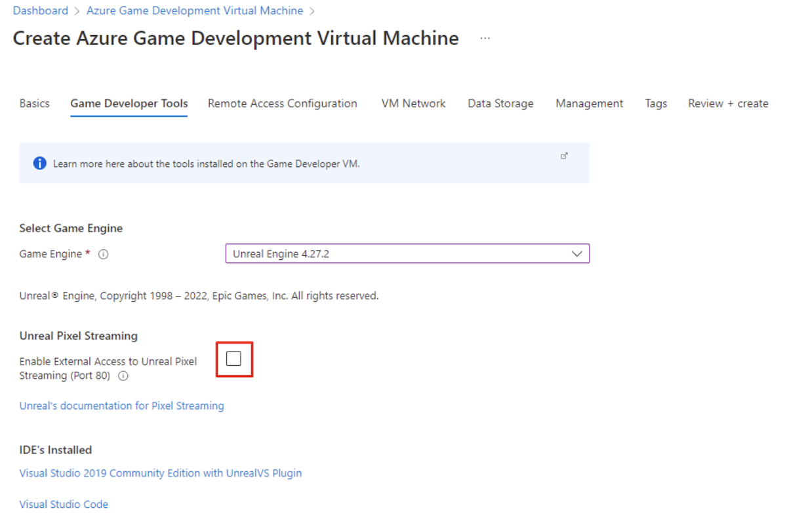
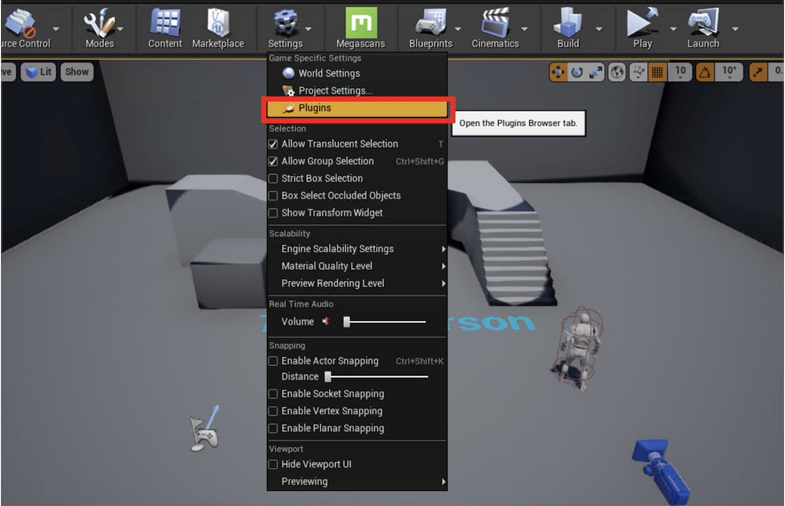
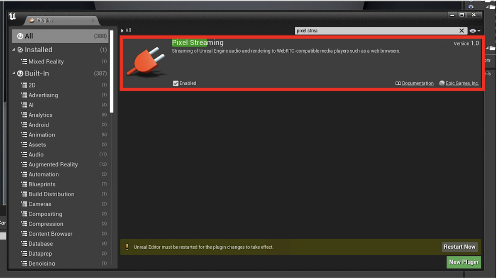
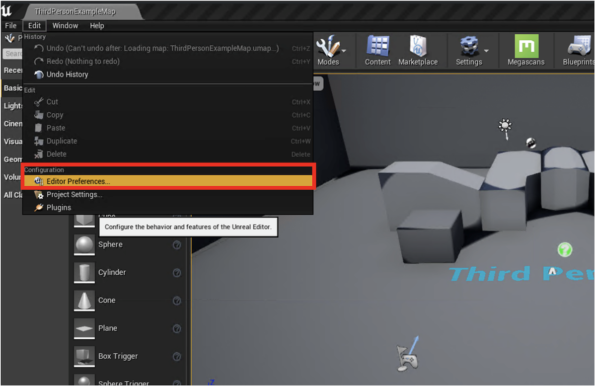
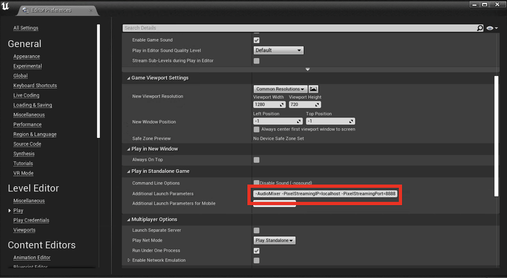
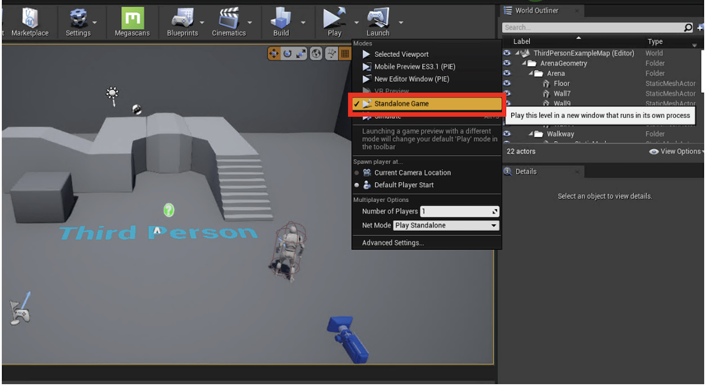
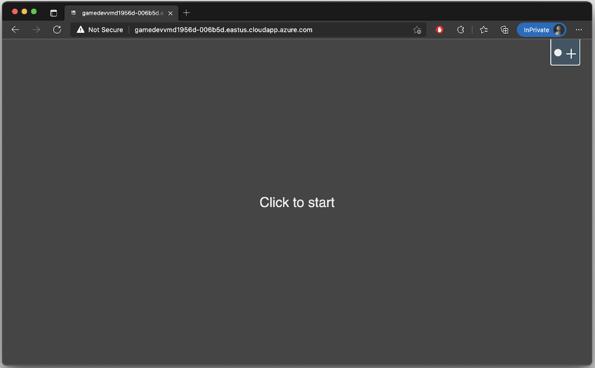

# Enabling Pixel Streaming 

With Unreal’s Pixel Streaming feature, you can stream your 3D application to any remote user with a modern web browser. The Azure Game Development VM comes with an option to enable Pixel Streaming access and with a few other steps, you can share your project in just minutes. 

## Enable Pixel Streaming during VM creation

1. When creating the Azure Game Development VM, you must check the box to enable the Unreal Pixel Streaming port access. 

2. Once the Azure Game Development VM is created and an Unreal Editor project is loaded, select the Plug-in's option from the settings menu on the top of the Editor 

3. Find or search for Pixel Streaming and click on the Enabled checkbox to install the Plugin. You will need to restart the Unreal Editor for the changes to take effect. 

4. When Unreal has restarted select the Editor Preferences item, under the Edit menu.

5. With the Editor Preferences window open, find or search for Additional Launch Parameters. It can be found under the Level Editor -> Play section on the left side of the window. Add the following values to the setting: **-AudioMixer -PixelStreamingIP=localhost -PixelStreamingPort=8888**

6. Close the Editor Preferences window/tab. 
7. Along the top of the editor, open the dropdown menu next to the Play icon and choose the selection Standalone Game. This will run the game in its own process, which is necessary to utilize the settings added in Step 5.

8. Once the game is launched in its own window, the game will connect to the Pixel Streaming server process running on the VM. In order to connect a browser from your local machine to the game, you must know the public IP address or the DNS Name of the Game Development VM.  An easy place to find this information is on the Overview panel of the VM instance in the Azure Portal.

9. Navigating a browser to the value listed in either the Public IP address or DNS Name should result in a view such as the one below.

10. Clicking the text in the middle, should change the text to a play icon.

11. Clicking the play icon, will begin streaming the game process from the remote Azure Game Development VM to your local browser window.

 
Congratulations, you have setup & enabled pixel streaming with your Unreal application. All the keyboard and mouse inputs to the browser window will be transmitted to the game process on the VM, so you can play the game as if it was on your local machine. 

## Next steps 

To learn more about Unreal’s Pixel Streaming and its features, please refer to Epic Games’ documentation for [Pixel Streaming](https://docs.unrealengine.com/4.27/en-US/SharingAndReleasing/PixelStreaming/). 
 
