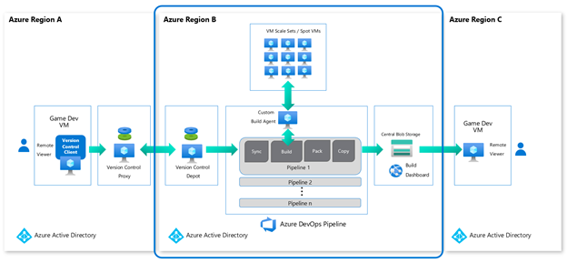
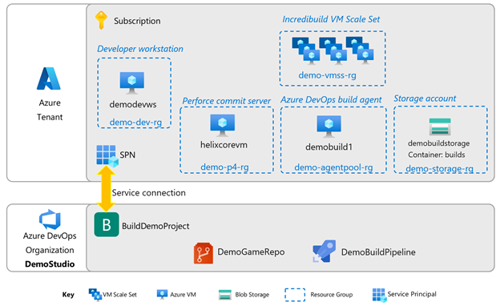

# Azure Cloud Build Pipelines
A guide to creating a demo build pipeline 

## Overview
This document will guide you through all the steps required to create a basic Azure build pipeline like the one seen in the Game Developer Conference 2022 talk entitled “Harness the power of Azure cloud builds from development to deployment”. 
The focus of this documentation is the portion from version control through build distribution, which is the blue highlighted portion of the overall architecture below. We will use a popular Unreal Engine 4 sample, ShooterGame, as the game build and pipeline.

While we recommend using the Azure Game Development VM for this exercise, will not be covering the specifics of it, nor Virtual Desktop Infrastructure portion here. For that, please see documentation for the [Azure Game Development VM]().  
This is a large guide, so it’s best to take some time to review it before working on it, to understand what you might need ahead of time.

## Broad Prerequisites
This document assumes a basic working knowledge of all components involved: how to set up a Perforce instance and do an initial population of a code depot, navigating Azure DevOps, setting up Unreal Engine 4, and working in Azure in general. Links to more detail are provided where appropriate.
You will need the following Azure services available to you:
1.	A working Azure Subscription 
2.	An Azure DevOps tenant
It is important that you are able to access both resources using the same user account.

## Deployment Planning
Here’s how we plan to deploy each of the components in terms of Azure resource groups and Azure DevOps project.

## Azure Subscription Prerequisites
This guide assumes the use of the Azure Game Developer VM as the developer workstation and the build agent. At present, this requires availability of an NV-series (GPU equipped) VM SKU. If you intend to follow this, please check that you have enough quota in your region for you subscription to allocate two such VMs. You can check and request quota increases at [Per VM Quota Requests](https://docs.microsoft.com/azure/azure-portal/supportability/per-vm-quota-requests).

Here’s the order in which we will be setting up and testing this demo pipeline.

Section 1: [Development workstation](./azurecloudbuilds-1-devworkstation.md)
- Create the developer workstation VM

Section 2: [Version control](./azurecloudbuilds-2-versioncontrol.md)
- Create the Perforce Helix Core commit server
- Create the code depot
- Install Azure Storage Explorer

Section 3: [Azure DevOps organization and project](./azurecloudbuilds-3-azdo.md)
- Create the Organization 
- Install Perforce extensions
- Create a Personal Access Token
- Create a Project
- Create a service principal and set up a service connection to Azure

Section 4: [The Build agent](./azurecloudbuilds-4-buildagent.md)
- Create the build agent VM
- Install the Azure DevOps agent
- Install and configure Incredibuild

Section 5: [Simple build distribution](./azurecloudbuilds-5-dist.md)
- Create Azure storage account and blob container

Section 6: [The Azure DevOps pipeline](./azurecloudbuilds-6-azdopipeline.md)
- Create the pipeline
- Set up the Perforce trigger

Section 7: [Testing](./azurecloudbuilds-7-testing.md)

## Saving set up information
As you set up the various components, there will be many pieces of configuration data you will need in downstream steps. When you see  

     :pencil: *Save this info!*  

...please take note of the configuration values and save them temporarily in a consolidated list, to make setup easier.

## Troubleshooting and Conclusions
If you come across any problems in your set up, look at the [Troubleshooting](./azurecloudbuilds-9-troubleshooting.md) section to see if any of the information there could help.

Finally, see what else you could do with this pipeline in the [Conclusion](./azurecloudbuilds-8-conclusion.md). We also highlight some other customer examples there.

We hope you find this guide useful. Please send us feedback at EMAIL.
