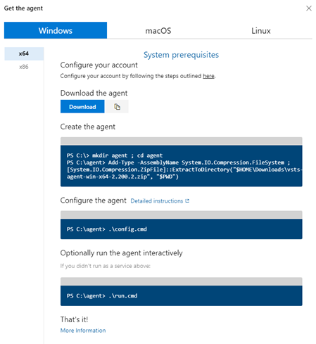
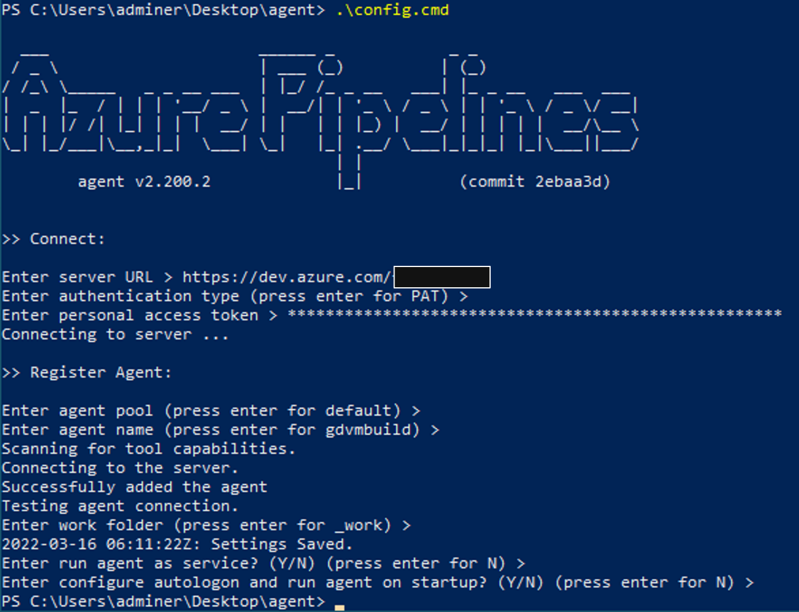
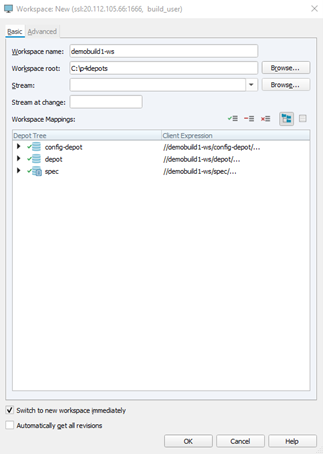

# Section 4: The Build Agent

[](media/cloud-build-pipeline/acb4-buildagent/acb4-roadmap.png)

The build agent is the machine that will do the work of the build pipeline. In this section, we will set up a custom (also called self-hosted) Azure DevOps build agent.

The easiest way to set up a build agent is through the Azure Game Development Virtual Machine from the Azure Marketplace. It contains all the major components needed for this build pipeline, including Unreal Engine 4.27, Perforce, and Visual Studio 2019.

[](media/cloud-build-pipeline/acb4-buildagent/gamedevvmazureoffer.png)

Alternatively, select an Azure VM or physical machine that you would like to use, and install the following software packages:

- Unreal Engine 4 (version 4.27 to match the version of the demo game, ShooterGame)
- [Perforce Visual Client (P4V)](https://www.perforce.com/downloads/helix-visual-client-p4v)
- [Perforce Helix Admin Tool (P4Admin)](https://www.perforce.com/downloads/administration-tool)
- [Visual Studio 2019 or 2022](https://azure.microsoft.com/)
- [Incredibuild](https://www.incredibuild.com)

## Setting up the build agent VM

1. Find the [Azure Game Development VM](https://azuremarketplace.microsoft.com/marketplace/apps/microsoft-agci-gaming.agci-gamedev-vm?tab=Overview) offering in the Azure Marketplace and create a VM.

[](media/cloud-build-pipeline/acb4-buildagent/gdvmcreate1.png)

2. Fill in your Subscription, Resource Group (create a new one if desired), Region.

3. Select your VM size. For the demo, you can use the default VM choice. Note: the Game Development VM currently ships on N-series VMs, so please ensure you have [enough quota](/azure/azure-portal/supportability/per-vm-quota-requests) on these SKUs.  

4. Fill in the VM name, admin name, password. For operating system, either Windows 10 or Windows Server 2019 works well, and the choice depends on the type of licenses you own.

5. Go to the next step: Game Developer Tools.

6. On the next page, for Select Game Engine, select Unreal Engine 4.27.2.  The page will expand.

[](media/cloud-build-pipeline/acb4-buildagent/gdvmcreate2.png)

7. In Connect to and sync a Perforce depot, check the box.

8. In Perforce Configuration, fill in:
    - **P4 Port**:  ssl:*{ip address of your P4 server}*:1666
    - **P4 User**: your build user name
    - **P4 User password**: your build user’s password
    - **P4 Client Workspace**: you can accept the default suggestion. Just make sure this workspace name is unique and does not exist for any other user.
    - **Configure P4 Workspace by**: Using Client View mappings.

9.	For P4 Client Views, fill in:
    - **Depot path**: //depot/...
    - **Relative path underneath the Client Workspace**: /...

10.	Leave all other choices as default.

:pencil: ***Save this info!*** :pencil:
- P4 client (workspace) name
- Depot path

11.	Go to the next step: Remote Access Configuration

12.	In the next page, **Remote Access Technology**: choose **RDP**.

[](media/cloud-build-pipeline/acb4-buildagent/gdvmcreate3.png)

13. At this point, you can click on Review + create for purposes of this demo. Click on Create once the review is completed.

The VM will take some time to provision. Once completed, open a Remote Desktop session with the VM.

## Unreal Engine licensing

1. Upon login to the VM, an Epic Games license selection screen will be presented. Please select a license version. Find out more about Unreal licenses [here](https://www.unrealengine.com/download).

2. Next, you will be asked to log in to the Unreal Launcher, so have your Epic Games login details handy.

3. At this point, some command windows will pop up to show that the system is installing some packages like the Windows GDK. You can let it continue while you proceed with the rest of the setup.

## Install Azure DevOps build agent on the build machine

A build agent is a small executable that will identify a machine as an available build machine for Azure DevOps.

1. On the build machine, open the Edge browser and navigate to https://dev.azure.com/*{your Organization name}*

2. Click on Organization settings in the bottom left of the web page.

[](media/cloud-build-pipeline/acb4-buildagent/orgsettings.png)

3. In the left toolbar, click on **Agent Pools**.

[](media/cloud-build-pipeline/acb4-buildagent/agentpoolsmenu.png)

4. Click **Default**, then click **Agents**, then click **New agent**.

5. A pop-up will appear with instructions; follow these.

[](media/cloud-build-pipeline/acb4-buildagent/installagent1.png)

6. Click **Download the agent** and let it download to the default location.

7. Open a Powershell window by typing **powershell** in the Windows search bar. Execute the commands in the instructions line-by-line. You can create the agent folder referenced in the instructions, in somewhere like the root of your c: drive:

```dos
cd c:\
mkdir agent ; cd agent
Add-Type -AssemblyName System.IO.Compression.FileSystem ; [System.IO.Compression.ZipFile]::ExtractToDirectory("$HOME\Downloads\vsts-agent-win-x64-2.200.2.zip", "$PWD")
```

8.	Run the agent configuration script

```dos
.\config.cmd
```

9.	Fill in the following:

[](media/cloud-build-pipeline/acb4-buildagent/installagent2.png)

- **Server URL**: https://dev.azure.com/*{your instance name}*
- **Authentication Type**: hit enter for PAT
- **Enter personal access token**: copy and paste the token that you saved from before
- **Enter agent pool, agent name, work folder**: for all these, press enter to accept defaults

10.	Run agent as a service and configure autologon/run agent on startup? For this demo, press enter for N, for both. This means you will have to run the agent manually, but it will show the results of getting a job in a more obvious way, for demo purposes.

11.	Now that everything is set up, run the agent. Making sure you are in the agent folder, run

```dos
.\run.cmd
```

Your powershell window should now show the agent running and listening for jobs.

[](media/cloud-build-pipeline/acb4-buildagent/installagent3.png)

Every time you restart this build machine, please remember to restart the agent with the same run.cmd executable. Alternatively, you can reinstall it as a service.

To confirm that your build agent is connecting correctly with Azure DevOps, look in the browser in Azure DevOps on the Agents page where you clicked on New agent before. You should now see your build agent appear as being Online in the Default pool, like the image below.

[](media/cloud-build-pipeline/acb4-buildagent/agentpool.png)

## Setup build output folder

1. Create a folder c:\BuildOutput. Completed builds will be put here.

## Set up Perforce build user workspace

1. Open p4v (Perforce Visual Client) and log in as the build user.

2. Configure the workspace as follows:

[](media/cloud-build-pipeline/acb4-buildagent/p4workspace.png)

3. Make sure you configure the workspace with the allwrite option. This prevent file access errors when Perforce marks the files read-only by default. See [this link](https://stackoverflow.com/questions/48195633/prevent-perforce-from-marking-files-as-read-only) for more info.

## Optional: Build acceleration

Incredibuild can help accelerate your compile jobs. This package is not installed by default. If you would like to try it, please refer this guide on [setting up Incredibuild on your build agent](./incredibuild-scale-out-your-cloud-builds.md).

## Next steps

Next, go to Section 5: [Simple build distribution](./azurecloudbuilds-5-dist.md).

Or return to the [Introduction](./azurecloudbuilds-0-intro.md).

Find out more about the [Azure Game Development VM](../game-dev-virtual-machine/overview.md).

Troubleshooting page is [here](./azurecloudbuilds-9-troubleshooting.md).
