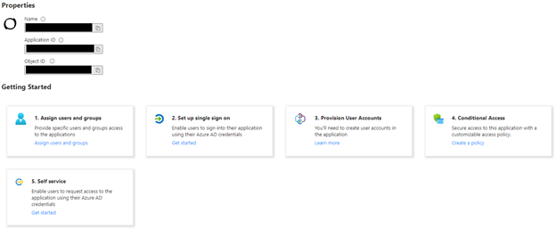
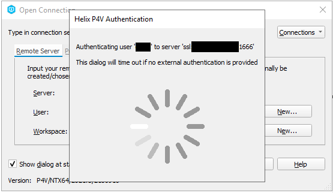
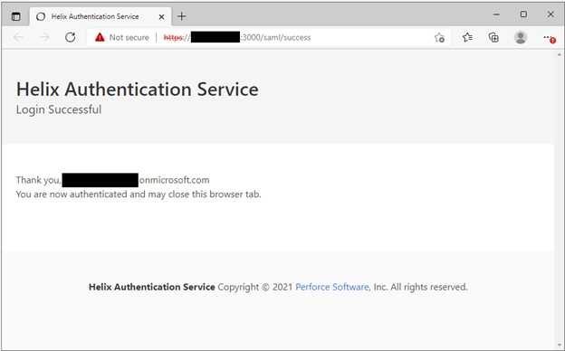

# Using AAD together with Perforce

## Overview

To use Azure Active Directory as an Identity Provider for Helix Core, Perforce has developed two pieces of software that need to be installed and configured:

1. Helix Authentication Service (HAS)
2. Helix Authentication Extension

The Service acts as a Token Service in the Authentication flow, the Extension configures Helix Core to make use of that Token Service for Authentication.

## Prerequisites

To configure Helix Core to use Azure Active Directory (AAD) as its Identity Provider, a Helix Core commit server needs to be available. For this guide we have installed Helix Core through Perforce’s Enhanced Studio Pack (ESP) in the Azure Marketplace. It contains Helix Core, Swarm, Hansoft and a Windows workstation, with 5 licenses to go with that.

## First Log on to the Helix Core Virtual Machine

1. SSH into the Virtual Machine
2. Move to the perforce user

```bash
sudo su – perforce
```

3. Allow the p4 client to create a logged-on context to the database

```bash
p4login -v 1
```

## Install Helix Authentication Service

The official documentation for installing Helix Authentication Service (HAS) from Perforce can be found here. In order to group the whole flow in a single document, below are the main commands needed to install HAS.

In this walkthrough we install HAS on the same machine as Helix Core. HAS can also be installed on a dedicated machine, so not to utilize resources from the commit server.

On CentOS we can install the Proxy through YUM, and the Enhanced Studio Pack installation has already added the Perforce repository to the YUM configuration. So, all we need to do is install HAS:

1. SSH into the Virtual Machine
2. Move to the perforce user

```bash
sudo su – perforce
```

3. Install HAS

```bash
sudo yum install helix-auth-svc
```

After this command HAS is installed and running. In order to be able to access the endpoint the Network Security Group needs to be opened:

1. In the **Azure portal**, go to the **Resource Group** where the ESP is installed
2. Select the **Network Security Group**
3. Click on **Inbound security rules** on the left
4. Click **+ Add** on the top of the blade
5. Fill out the input fields:
    1. Source: IP Addresses
    2. Source IP addresses/CIDR ranges: the IP address (range) you are connecting from
    3. Source Port ranges: *
    4. Destination: Any
    5. Service: Custom
    6. Destination port ranges: 3000
    7. Protocol: Any
    8. Action: Allow
    9. Name: HAS

## Install Helix Authentication Extension

The extension cannot be installed through YUM at this time. It can be downloaded from the official Perforce Github repository. This walkthrough downloads the latest version from Github, as it contains some new bits around the use of Managed Identities that have not been added to the release yet, at the time of writing. It is also possible to download a QA tested release from Perforce’s Github, but that does not support the Managed Identity flow.

1. SSH into the Virtual Machine
2. Move to the perforce user

```bash
sudo su – perforce
```

3. Download and extract the extension

```bash
cd /tmp
wget https://github.com/perforce/helix-authentication-extension/archive/refs/heads/master.zip
unzip master.zip
```

1. Package and install the extension

```bash
cd helix-authentication-extension-2021.2/
p4 extension --package loginhook
p4 extension --install loginhook.p4-extension –allow-unsigned -y
```

## Setting up Perforce Users and Groups

When the Enhanced Studio Pack is just installed, there is only one user, and there are no groups. For this walkthrough we’ll create a group of users that need to log on using HAS, and we’ll create a user that is part of that group:

1. SSH into the Virtual Machine
2. Move to the perforce user

```bash
sudo su – perforce
```

3. Create a user named John

```bash
p4 user -f john
```

4. Change the following fields:
    1. Email: should be the email address John has in the AAD tenant
    2. FullName: John’s full name
5. Exit vi and save the configuration

```bash
:wq <ENTER>
```

6. Set up Perforce to allow for SSO Authentication to be used:

```bash
p4 configure set auth.sso.allow.passwd=1
```

7. Giving the newly created user a random password in Perforce, as they will be using AAD to log in:

```bash
yes $(uuidgen) | p4 -u perforce passwd john
```

8. Create a group called SSO

```bash
p4 group sso
```

The Users field is an array, so create a new line after Users:, indent by using a TAB and add John to the list of users in this group
[](media/cloud-build-pipeline/perforce-has-perforce-group.png)

10.	Exit vi and save the configuration

```bash
:wq <ENTER>
```

## Option 1: Configuring HAS and AAD for SAML

### Configure AAD for SAML

The easiest way to configure HAS to work with AAD is by using Perforce’s AAD Marketplace solution. A complete walkthrough can be found here. The basic steps are:

1. Sign in to the **Azure Portal**
2. Go to your **Active Directory**
3. Choose **Enterprise Application** from the menu on the left
4. Click **+ New application**
5. Search for **Perforce** in the **Search application box**
6. Select **Perforce Helix Core – Helix Authentication Service**
7. Click **Create**

After the **Enterprise Application** was successfully deployed, you should see a screen like this:

[](media/cloud-build-pipeline/perforce-has-aad-overview.png)

First, we’ll add some users to make use of the **Enterprise Application**:

1. Click **1. Assign users and groups**
2. Click **+ Add user/group** from the top of the blade
3. Select the users you’d want to add
4. Hit the **Assign** button

Now, we’ll configure the single sign on. For this step, you’ll need the public IP address from the machine you have configured HAS on.

1. Go back to the **Overview** blade
2. Click **2. Set up single sign on**
3. Select **SAML**
4. In **Basic SAML Configuration**, choose **Edit**
5. In **Identifier**, add https://&lt;&lt;PUBLIC IP ADDRESS&gt;&gt;:3000/saml
6. In **Reply URL**, add https://&lt;&lt;PUBLIC IP ADDRESS&gt;&gt;:3000/saml/sso
7. In **Sign on URL**, add https://&lt;&lt;PUBLIC IP ADDRESS&gt;&gt;:3000/
8. Hit **Save** on the top of the blade

### Configure the Helix Authentication Extension for SAML

To complete this step, you’ll need the public IP address from the machine where HAS has been installed.
1. SSH into the Virtual Machine
2. Move to the perforce user

```bash
sudo su – perforce
```

3. Configure the extension
```bash
p4 extension --configure Auth::loginhook
```
    1. change the following:
        1. ExtP4USER: perforce
        2. Auth-Protocol: saml
        3. Service-URL: https://&lt;&lt;PUBLIC IP ADDRESS&gt;&gt;:3000
    2. Exit vi and save the configuration
    :wq <ENTER>
4. Configure the extension instance
```bash    
p4 extension --configure Auth::loginhook --name loginhook-a1
```
    1. change the following:
        1. enable-logging: true
        2. name-identifier: nameID
        3. non-sso-users: perforce
        4. sso-groups: sso
        5. user-identifier: email
    2. Exit vi and save the configuration
    :wq <ENTER>

### Configure Helix Authentication Service for SAML

To configure HAS, you’ll need 3 pieces of information:

1. The IP address of the Virtual Machine that hosts HAS
2. The AAD App Federation Metadata Url:
    1. Go to the **Azure portal**
    2. Go to **Azure Active Directory**
    3. Go to **Enterprise Applications**
    4. Select the **Enterprise Application** you created earlier
    5. Go to **Single sign-on** on the left
    6. Scroll down to **3. SAML Signing Certificate**
    7. Copy the **App Federation Metadata Url**
3. The AAD Login URL
    1. Go to the **Azure portal**
    2. Go to **Azure Active Directory**
    3. Go to **Enterprise Applications**
    4. Select the **Enterprise Application** you created earlier
    5. Go to **Single sign-on** on the left
    6. Scroll down to **4. Set up Perforce Helix Core – Helix Authentication Service**
    7. Copy the **Login URL**

Now we can go to the Virtual Machine and configure HAS:

1. SSH into the **Virtual Machine**
2. Move to the perforce user

```bash
sudo su – perforce
```

3. Create a new configuration file:

```bash
cd /opt/perforce/helix-auth-svc/
sudo mv .env .envold
sudo vi .env
```

4. Contents (replace the 3 entries with your own values):

```ini
PROTOCOL=saml
SVC_BASE_URI=https://<<PUBLIC IP ADDRESS>>:3000
SAML_IDP_SSO_URL=<<AAD LOGIN URL>>
SAML_SP_ENTITY_ID=https://<<PUBLIC IP ADDRESS>>:3000/saml
LOGGING=/opt/perforce/helix-auth-svc/logging.config.js
SAML_IDP_METADATA_URL=<<APP FEDERATION METADATA URL>>
CLIENT_CERT_CN=LoginExtension
```

5. Exit

```bash
:wq <ENTER>
```

After this step everything is configured, and we should restart both the Extension and HAS:

1. SSH into the Virtual Machine
2. Move to the perforce user

```bash
sudo su – perforce
```

3. restart HAS and the Extension

```bash
sudo systemctl restart helix-auth
p4 admin restart
```

## Option 2: Configuring HAS and AAD for OIDC

### Configure AAD for OIDC

Open ID Connect is easiest configured through an AAD Application Registration. To complete this step, you’ll need the public IP address of the Virtual Machine that hosts HAS. Follow these steps:

1. Sign in to the **Azure Portal**
2. Go to your **Active Directory**
3. Choose **App Registrations** from the menu on the left
4. Click **+ New registration**
5. At **Redirect URI**:
    1. Select **Web**
    2. For the **URI**, put in https://&lt;&lt;PUBLIC IP ADDRESS&gt;&gt;:3000/oidc/callback
6. Click **Register**
7. After the creation, select **Certificates & secrets** from the menu on the left
8. Hit **+ New client secret**
9. Fill out a **description** and **expiration**, and click **Add**
10. Make sure to **copy the Secret** as it will not be retrievable after you leave the page

### Configure the Helix Authentication Extension for OIDC

To complete this step, you’ll need the public IP address from the machine where HAS has been installed.

1. SSH into the **Virtual Machine**
2. Move to the perforce user

```bash
sudo su – perforce
```

3. Configure the extension
    1. p4 extension --configure Auth::loginhook
        1. change the following:
            1. ExtP4USER: perforce
            2. Auth-Protocol: oidc
            3. Service-URL: https://&lt;&lt;PUBLIC IP ADDRESS&gt;&gt;:3000
    1. Exit vi and save the configuration

    ```bash
    :wq <ENTER>
    ```

4. Configure the extension instance
    1. p4 extension --configure Auth::loginhook --name loginhook-a1
        1. change the following:
            1. enable-logging: true
            2. name-identifier: given_name
            3. non-sso-users: perforce
            4. sso-groups: sso
            5. user-identifier: user
    1. Exit vi and save the configuration

    ```bash
    :wq <ENTER>
    ```

### Configure Helix Authentication Service for OIDC

To configure HAS, you’ll need 3 pieces of information:

1. The IP address of the Virtual Machine that hosts HAS
2. The AAD App ID:
    1. Go to the **Azure portal**
    2. Go to **Azure Active Directory**
    3. Go to **App registrations**
    4. Select the **App registration** you created earlier
    5. Copy the **Application (client) ID**
3. The AAD App Client Secret
    1. You should have saved this when you created the Secret
4. The AAD tenant ID
    1. Go to the **Azure portal**
    2. Go to **Azure Active Directory**
    3. Copy the **Tenant ID**

Now we can go to the Virtual Machine and configure HAS:

1. SSH into the Virtual Machine
2. Move to the perforce user
 
```bash 
sudo su – perforce
```

3. Create a new configuration file:

```bash
cd /opt/perforce/helix-auth-svc/
sudo mv .env .envold
sudo vi .env
```

4. Contents (replace the 3 entries with your own values):

```ini
PROTOCOL=oidc
SVC_BASE_URI=https://<<PUBLIC IP ADDRESS>>:3000
LOGGING=/opt/perforce/helix-auth-svc/logging.config.js
CLIENT_CERT_CN=LoginExtension
OIDC_ISSUER_URI=https://login.microsoftonline.com/<<AAD TENANT ID>>/v2.0
OIDC_CLIENT_ID=<<AAD APP ID>>
OIDC_CLIENT_SECRET_FILE=client-secret.txt
```

5. Exit

```bash
:wq <ENTER>
```

6. Now, we need to store the client secret in the designated file:

```bash
sudo vi client-secret.txt
```

Just paste in the Client Secret, nothing else, and close VI

```bash
:wq <ENTER>
```

After this step everything is configured, and we should restart both the Extension and HAS:

1. SSH into the Virtual Machine
2. Move to the perforce user

```bash
sudo su – perforce
```

3. restart HAS and the Extension

```bash
sudo systemctl restart helix-auth
p4 admin restart
```

## Test the setup

Testing the setup can be done through multiple ways. Examples include the Windows Workstation that can be deployed as part of the Enhanced Studio Pack, or the use of the Azure Game Dev VM. In the end we’ll need a machine with the Perforce Client tools installed, either P4V or the CLI tools. It can be an on-premises machine or a cloud-based machine. 

In this walkthrough we’ll RDP into an instance of the Azure Game Dev VM, as it has all the tools installed.

To test the setup, you’ll need the IP address of the Helix Core instance. If the machine is in the same Virtual Network, this can be a Private IP address. If it is not in the same Virtual Network, it needs to be the public IP address. Regardless, make sure this machine is listed in the Network Security Group to be able to access Helix Core.

1. RDP into the Virtual Machine
2. Open up a Windows Terminal
3. Set the P4 Environment Variables:

```dos
p4 set P4USER=john
p4 set P4PORT=ssl:<<PERFORCE IP ADDRESS>>:1666
```

4. Open P4V, put in the username and the address if it is not set correctly
5. Hit Connect, you should see a browser opening, and P4V waiting for that to return
[](media/cloud-build-pipeline/perforce-has-p4v-loading.png)
6. The browser will complain the connection is not secure, this is because we have not yet correctly configured SSL, by default HAS is using a self-signed certificate for that. If you accept this for now, you will be able to log in using AAD. Once you have successfully done that, you’ll see something like this in the browser:
[](media/cloud-build-pipeline/perforce-has-has-success.png)
7. When you open P4V back up, you’ll see it has been logged in.

## Setting up a custom domain name with SSL

After completing all the steps above, the implementation uses an IP Address for HAS, and gives the end-user warnings about the security of that. HAS can be configured to use custom domains, and use CA-signed certificates. To configure this, we must alter some of the configurations we made earlier. It is outside of the scope of this walkthrough to describe how to set up DNS, and how to obtain a proper SSL certificate. This walkthrough assumes the DNS is set up, and the certificates are obtained.

### Make the Certificate available for HAS

The certificate- and the key-file should be made available to HAS in the folder:

- /opt/perforce/helix-auth/certs

The certificate should be named:

- server.crt

The key should be named:

- server.key

### Change the AAD configuration (SAML)

1. Go to the **Azure portal**
2. Go to **Azure Active Directory**
3. Go to **Enterprise Applications**
4. Select the **Enterprise Application** you created earlier
5. Go to **Single sign-on** on the left
6. On **1. Basic SAML Configuration**, hit **Edit**
7. For the 3 entries, change the **IP address** to the **DNS name**

### Change the AAD configuration (OIDC)

1. Go to the **Azure portal**
2. Go to **Azure Active Directory**
3. Go to **App registrations**
4. Select the **App registration** you created earlier
5. Select **Authentication** from the menu on the left
6. On the blade, click on the **Redirect URI**, and change the **IP address** to the **DNS name**

### Change the Extension configuration

1. SSH into the Virtual Machine
2. Move to the perforce user

```bash
sudo su – perforce
```

3. Configure the extension

```bash
p4 extension --configure Auth::loginhook
```

4. In the Service-URL, change the **IP address** to the **DNS name**
5. Exit vi and save the configuration

```bash
:wq <ENTER>
```

### Change the HAS configuration

1. SSH into the Virtual Machine
2. Move to the perforce user

```bash
sudo su – perforce
```

3. Edit the .env file

```bash
sudo vi /opt/perforce/helix-auth/.env
```

4. Change the IP address to the DNS name. In the SAML configuration this needs to happen for 2 parameters, for the OIDC configuration this only needs to happen for 1 parameter
5. Add the following 2 parameters:

```bash
SP_CERT_FILE='certs/server.crt'
SP_KEY_FILE='certs/server.key'
```

6. Exit vi and save the configuration

```bash
:wq <ENTER>
```

After this step everything is configured, and we should restart both the Extension and HAS:

1. SSH into the Virtual Machine
2. Move to the perforce user

```bash
sudo su – perforce
```

3. restart HAS and the Extension

```bash
sudo systemctl restart helix-auth
p4 admin restart
```

Now HAS is available using the configured domain name, using SSL. 

## Troubleshooting

Most issues can be resolved by using the log files from both the Extension and HAS. They can be found at these locations:
Extension:

- /p4/1/depots/p4-extensions/117E9283-732B-45A6-9993-AE64C354F1C5/1-data/log.json

HAS:

- /opt/perforce/helix-auth-svc/auth-svc.log

The documentation on the Perforce Github page has an extensive amount of troubleshooting tips.
